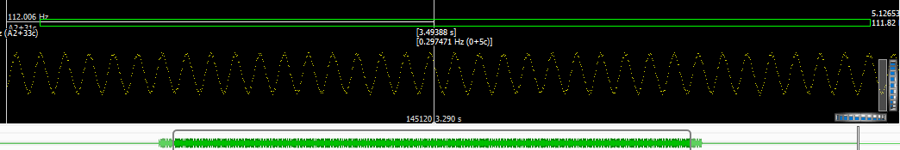

# [Analysis](../README.md) > Chorus

## Summary

The chorus effect is responsible for thickening-up the sound of the Juno 60. It takes a single channel from the [High pass filter](../Filter/HPF/README.me) and emits stereo channels.

The module contains 1 triangle-wave LFO, modulating 2 256-step Bucket-Brigade delay-lines (1 for left and 1 for right).  The modulation signal of the right delay-line is inverted so it is effectively 180 degrees out of phase with the left channel.

| Name | Mod rate | Min delay | Max delay | Outputs | Notes |
| --- | --- | --- | --- | --- | --- |
| Chorus 1 | 0.513 Hz | 0.00166 | 0.00535 | Stereo | Described as "mild chorus" |
| Chorus 2 | 0.863 Hz | 0.00166 | 0.00535 | Stereo | Described as "deeper richer chorus" |
| Chorus 1 + 2 | 9.75 Hz | 0.0033 | 0.0037 | Mono | Described as "similar to a Leslie rotary speaker" |

For reference:

* The Juno-60 service notes PDF labels the frequencies as being 0.5Hz, 0.83Hz and 1Hz (which is probably a typo for 10Hz).
* The Juno-6 service notes PDF labels the frequencies as being 0.4Hz, 0.67Hz and 8.06Hz.

I was worried that the Bucket-Brigade chips would introduce an large amount of bit-crushing to the effect - but it looks like the chips are effectively sampling at about 70kHz (so should be minor).

A discussion on the [KVR forum](http://www.kvraudio.com/forum/viewtopic.php?t=313797&start=15) indicates that a 12dB low-pass filter is used before the signal is sampled into the Bucket-Brigade chips.

It looks like there is non-linearity in the delayed signal (sawtooth looks more rounded).

To reduce distortion and noise (and the above-noted non-linearity), most Bucket-Brigade chorus effects use a signal compressor before the delay line - then an expander afterwards. I cannot see these steps in the Juno-60 schematics - so it is likely that you will get distortion if the input signal is high.

The [Pirkle FX book](../Resources/Book_PirkleFx.md) says that the minumim delay for chorus effects is normally 7ms.  My analysis indicates that the Juno chorus 1 & 2 effects could be classified as "flanger", and that the "1+2" effect could probably be better described as a "vibrato".

## How the modulation rate was calculated

The rates were calculated by observing the waveforms in Sonic Visualizer.

The signal has shows an obvious repeating pattern that can be measured.

For the "Chorus I+II" setting, the "Peak Frequency Spectrum" pane seems to be more useful:

The images shows that it takes approximately 3.49 seconds for 34 cycles. Which is 9.74Hz. @jpcima has created a [Python program](https://github.com/jpcima/rc-effect-playground/blob/master/tools/analyze.py) that has accurately measured 9.75Hz - so I'm going with that.

## How the minimum and maximum delay was calculated

The minimum and maximum delay was found by comparing the left and right channels. Each channel contains a copy of the original signal (so half of the peak-and-troughs line up exactly between the stereo channels). Each channel also contains a delayed copy of the original signal. The following image shows the analysis of "Juno 60 PulseChorus2.wav" at 2.8s into the sound.

In the middle of the image you can see that the signals exactly match up. You can then measure from this point to the matching pointon the delayed signals.

## See also

Will Pirkle's site contains a [nice write-up of the Roland Dimension-D](http://www.willpirkle.com/fx-book/project-gallery/) chorus unit. That design has a reduced amount of chorus applied to bass frequencies.

[Issue 2](https://github.com/pendragon-andyh/Juno60/issues/2) gathered some useful feedback from @cpcima and @SpotlightKid. They have a repo where they are reproducing chorus effects.
